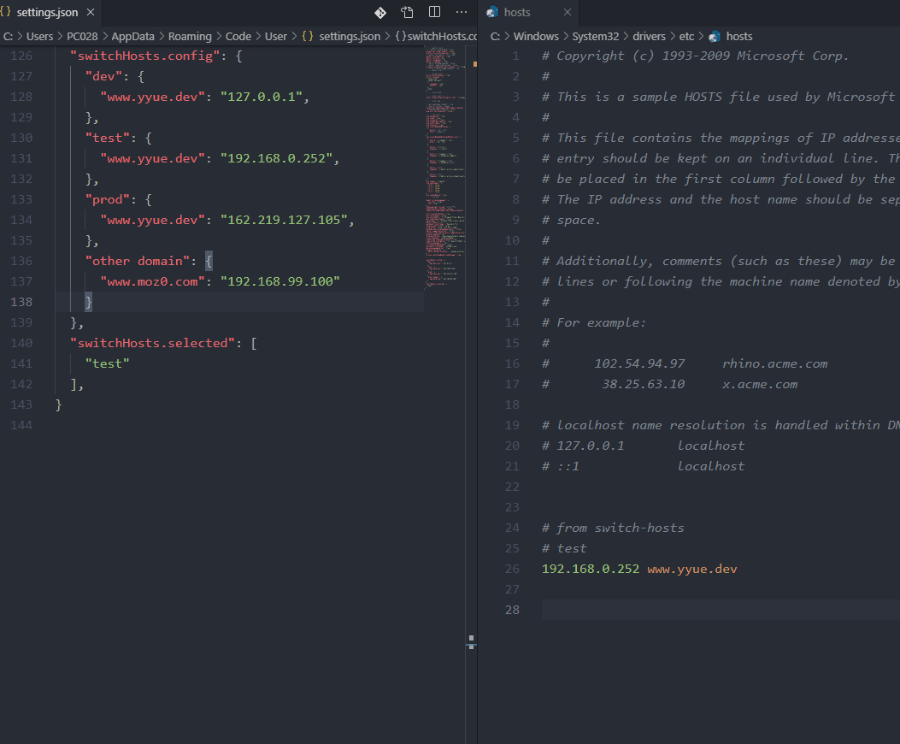

[English](https://github.com/mozyy/switch-hosts/blob/master/README.md) | 简体中文
# switch-hosts

切换系统hosts的vscode插件

## 功能

开发时可快速切换hosts配置
* 根据多个配置快速切换hosts
* 快速打开系统hosts文件
* 保存更新默认hosts



<!-- ## Requirements

If you have any requirements or dependencies, add a section describing those and how to install and configure them. -->

## 插件配置

该插件使用以下配置

* ```javascript
  "switchHosts.config": { // hosts方案配置
    "config name": {      // 配置名称
      "domain": "ip"      // 域名: ip
    }
  },
  ```
* ```javascript
  "switchHosts.selected": [ // 选中的配置
    "config name"           // 配置名称
  ],
  ```

## 已知问题

使用vscode的管理员权限保存hosts时, 最好是使用[environmentService.cliPath](https://github.com/microsoft/vscode/blob/21ce78cf25a7a3b82502f0fc9e764e7840b315b3/src/vs/platform/environment/node/environmentService.ts#L50), 所以在现在的解诀方案中, vscode的构建版本中的某些版本的判断可以会出错


## Release Notes

### 1.0.0

Initial release of switch-hosts

### 2.0.0

Complete basic functions:

* hosts config
* hosts save
* hosts selected

### 2.1.0

* hosts update default hosts
* add README features gif

### 2.2.0

* Support VS code Insiders version
* add open system hosts file:  
```Ctrl + Shift + p ```> ``` switch-hosts: openHostsFile ```
* add saved hosts notification

-------


**Enjoy!😁** 
